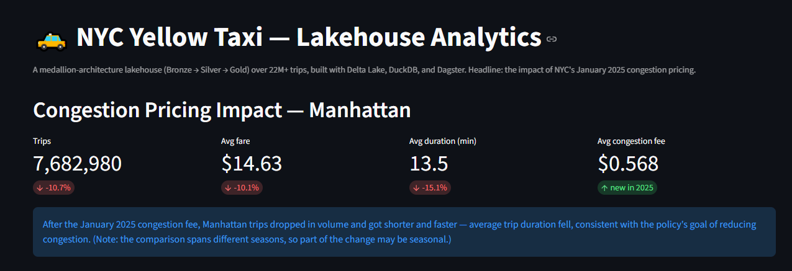
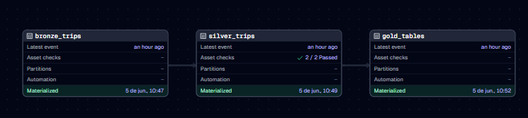
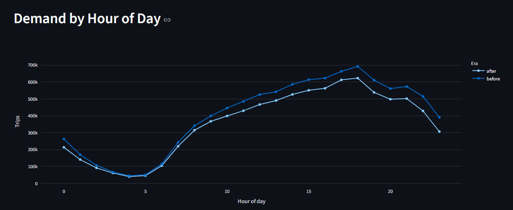
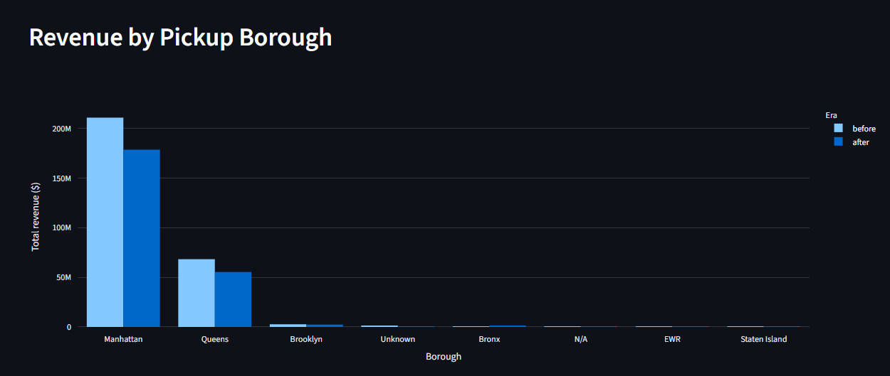
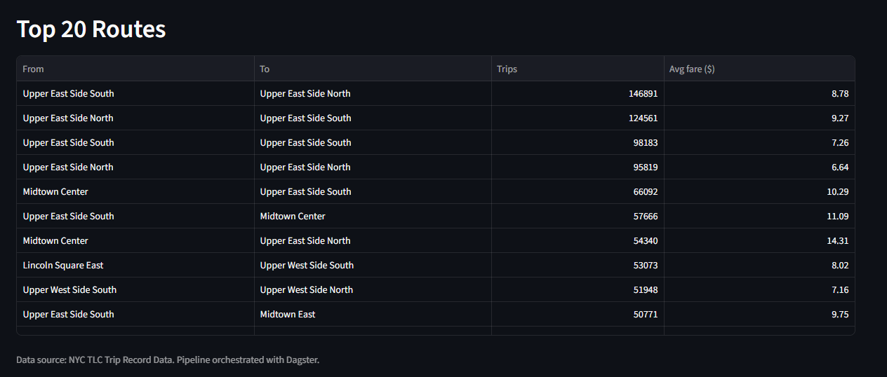

# 🚕 NYC Yellow Taxi — Medallion Lakehouse
Measuring the Impact of NYC Congestion Pricing on Taxi Demand

An end-to-end **data lakehouse** built on the medallion architecture (Bronze → Silver → Gold) over **22M+ NYC Yellow Taxi trips**, orchestrated with Dagster and surfaced through an interactive Streamlit dashboard.

**Headline insight:** how New York City's **January 2025 congestion pricing** changed taxi behaviour in Manhattan.

🔗 **Live dashboard:** [nyc-taxi-lakehouse.streamlit.app](https://nyc-taxi-lakehouse.streamlit.app)

---

## Skills Demonstrated

- Data Lakehouse Architecture
- Medallion Modeling
- Delta Lake Schema Evolution
- Data Quality Engineering
- Data Orchestration with Dagster
- Analytical SQL
- Dashboard Development
- Cloud Deployment

## The business question

In January 2025, NYC introduced a congestion fee for trips into the Manhattan central business district — visible in the data as a brand-new `cbd_congestion_fee` column that exists only from 2025 onward. By ingesting six months of data straddling the rollout (Oct 2024 – Mar 2025), this project asks: **did the policy change how people use taxis in Manhattan?**

**What the data shows (Manhattan pickups, before vs after):**

| Metric | Before | After | Change |
|---|---|---|---|
| Trips | 8,606,791 | 7,682,980 | −10.7% |
| Avg fare | $16.27 | $14.63 | −10.1% |
| Avg trip duration | 15.9 min | 13.5 min | −15.1% |
| Avg congestion fee | $0.00 | $0.57 | new in 2025 |

After the fee, Manhattan trips dropped in volume and the remaining trips became **shorter and faster** — average duration fell by ~15%, consistent with the policy's stated goal of reducing congestion. (Caveat: the comparison spans different seasons, so part of the shift may be seasonal rather than purely policy-driven — a deliberately honest framing.)



---

## Architecture

A medallion lakehouse in open **Delta Lake** format, orchestrated as a graph of assets in **Dagster**.

```
TLC Parquet files  ──▶  Bronze  ──▶  Silver  ──▶  Gold  ──▶  Streamlit dashboard
                       (raw,      (clean,       (business
                        faithful)  enriched)     aggregates)
```

- **Bronze** — raw TLC Parquet ingested faithfully, with ingestion metadata (`_ingested_at`, `_source_file`). Handles **schema evolution**: the 2025 files add `cbd_congestion_fee`, merged into the table while 2024 rows stay null. *22,346,537 rows.*
- **Silver** — cleaned and validated (removed non-positive fares, zero/absurd distances, inverted timestamps, invalid passenger counts), enriched by joining the TLC taxi-zone lookup to translate location IDs into real borough/zone names, and standardized the congestion fee across both schemas. *18,165,564 rows (~18.7% removed as invalid).*
- **Gold** — small, business-ready aggregate tables: congestion impact, demand by hour, revenue by borough, top routes.

### Orchestration & data quality (Dagster)

The pipeline is a graph of three assets with declared dependencies — Dagster resolves the execution order automatically — plus **asset checks** that validate the Silver layer (no negative fares, valid trip durations).



---

## Selected results

**Demand by hour of day** — overlapping daily curves, with the post-fee era consistently slightly lower at peak hours.



**Revenue by pickup borough** — Manhattan dominates, with a visible drop after the fee.



**Top routes** — short intra-Manhattan hops (Upper East Side, Midtown) lead by volume.



---

## Tech stack

| Layer | Tool |
|---|---|
| Storage format | Delta Lake (`deltalake` / delta-rs) |
| Query engine | DuckDB (Delta extension in the pipeline; Parquet for the deployed app) |
| Orchestration | Dagster (assets + asset checks) |
| Dashboard | Streamlit + Plotly |
| Language | Python |

---

## Running it locally

```bash
# 1. Create and activate a virtual environment
python -m venv .venv
source .venv/Scripts/activate        # Windows (Git Bash)
# source .venv/bin/activate           # macOS / Linux

# 2. Install dependencies
pip install -r requirements.txt

# 3. Download the raw data (~360 MB)
python src/nyc_taxi_lakehouse/download_data.py
python src/nyc_taxi_lakehouse/download_zones.py

# 4. Run the pipeline via Dagster
dagster dev -f src/nyc_taxi_lakehouse/definitions.py
# then open http://localhost:3000 and click "Materialize all"

# 5. Launch the dashboard
streamlit run dashboard.py
```

---

## Data source

[NYC TLC Trip Record Data](https://www.nyc.gov/site/tlc/about/tlc-trip-record-data.page) — Yellow Taxi, October 2024 through March 2025. Raw data is not versioned in this repository.
